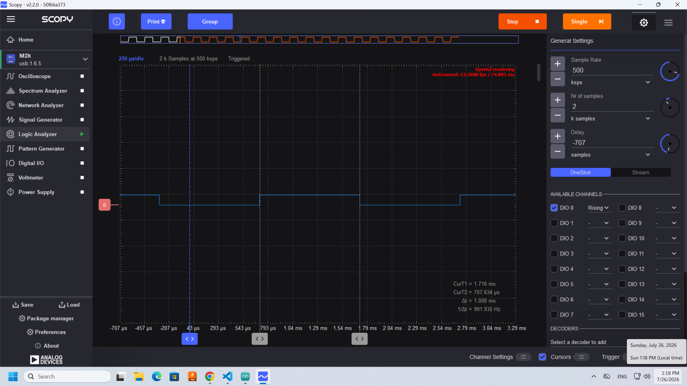
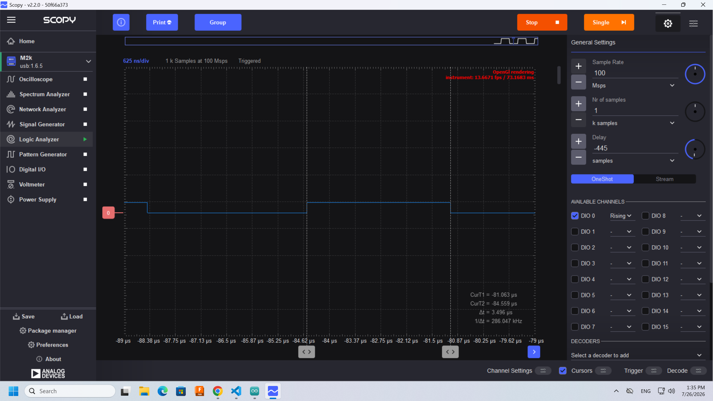
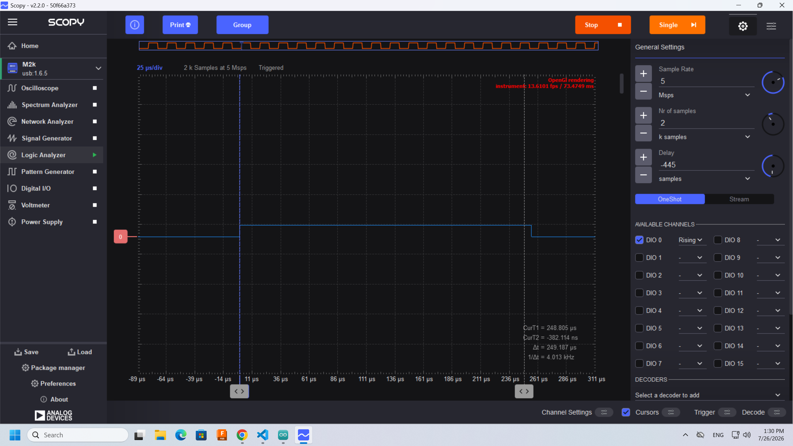

# Project 3: Measuring minimum delay in Arduino using the ADALM2000 logic analyzer

1. Understand the use of variables in code
2. Learn how to use a logic analyzer
3. Understand the concept of overhead and measure it

## resources

[Arduino Functions Reference](https://www.arduino.cc/reference/en/)

## Change Blink.ino code

You can copy the requirements to the AI agent, or code on your own.
If using the AI agent, please write below what changes were done compared to the original Blink code: Is there a difference in the code structure? What variables and function if any were added?

- Save Blink example as BlinkWithVariableDelay.ino in this folder
- Use a variable to change built in led (13) to grove led (4)
- Use a variable to change delay to 1 ms

run code:

- upload to arduino
- can you see the led blink? Why?

## Use logic analyzer to see and measure the blink

- connect ADALM2000 to grove kit:
  - gnd in ADALM to GND in arduino (black color is used as a standard for GND)
  - digital pin 0 (solid pink) to pin4 in arduino (why?)
- open scopy program
- connect to ADALM2000
- open scopy logic analyzer
- activate DIO0 and rising edge and run (why?)
I think that rising edge detects the trigger when the slope is positive (above the threshold of zero). I tried using HIGH as a trigger but the signal jittered a lot more, so maybe the derivative as a trigger is more precise?
- play with the scopy parameters until you can see the separate blinks. Which parameter(s) do you need to change?
- use cursors and sample rate to measure the pulse width
- take screenshots and add them to the README below.

## Measure overhead

- Remove the delay statements and upload the code
- Measure pulse width. What is the minimum time that the signal is HIGH and LOW? this is the overhead.
- Take screenshots and add them to the README below.

## even shorter blink

- delay() is limited to 1 ms. Find a function that delays 1 microsecond.
- Try different delays and measure the overhead.
- Take screenshots and add them to the README below.

## Git

- Commit the new README with your screenshots
- push to your repo.

## Exercise

Paste screenshots below.
Comparison of AI changes if any:

1 ms pulse:

Measuring the overhead with no delay statements between `digitalWrite(HIGH)` and `...(LOW)`:

Programmed delay of 247 us:
