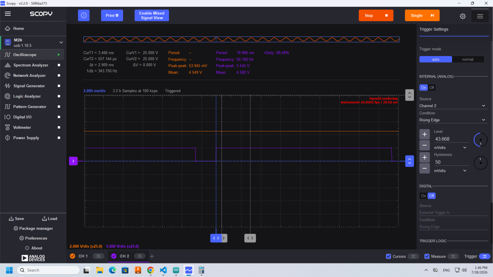
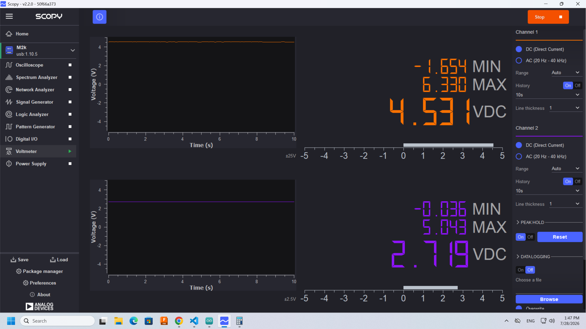
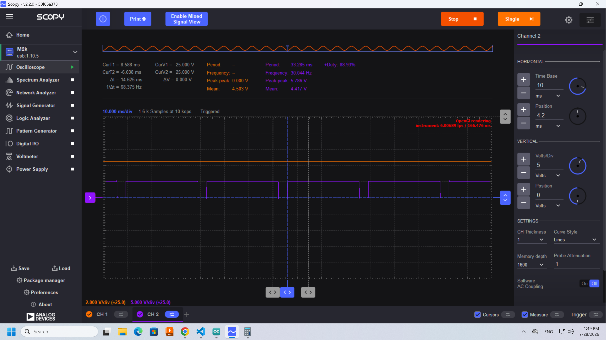
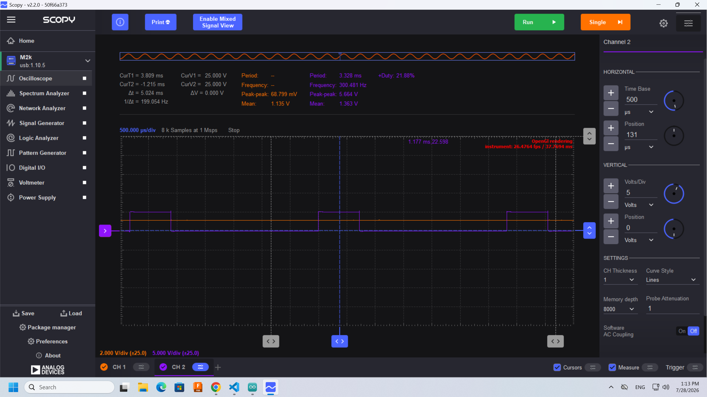
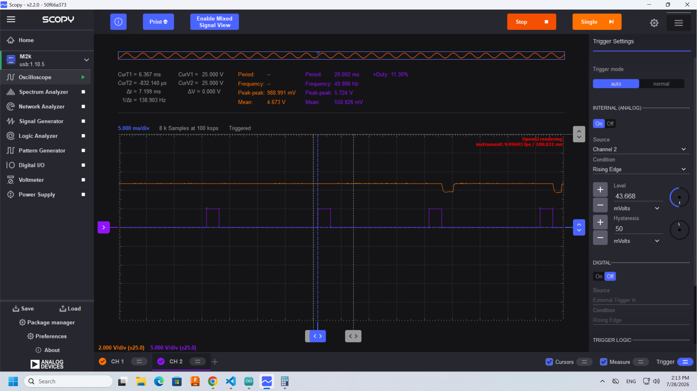

# Project7 - Analog!

1. Understand the difference between analog and digital signals
1. Learn to use a voltmeter and scope
1. Measure analog signals
1. Understand PWM and when to use it
1. Learn about MD_PWM package
1. Learn about servo motors
1. Understand arduino signal capabilities

## Adding a dimmer functionality to the LED

The purpose of this project is to dim and increase the led light using the rotary button.

- rotary is A0 in Arduino. connect gnd (in arduino) first to orange with stripe (in ADALM) and then A0 to orange.
- Use voltmeter in Scopy to see range of values when turning the rotary. Min = 0 V, max = 5.053 V
- create an Arduino file that reads the values from the rotary and prints them out. What is the range of the values? 
- pin 4 (grove LED) is not supported for PWM. Install package MD_PWM, and set pin 4 to be PWM using the package documentation.
- Using the rotary value, update the PWM value. Note the range of values that can be used according to package documentation. Change your code accordingly.
- test your code.
- View in scope: Connect Analog 2 (dark blue) to pin 4 in arduino (LED output). Play with the times and triggers until you see the PWM change when turning the rotary.  What is the duty cycle?

Here, duty cycle for channel 2 (PWM on LED pin) is ~89%. The input analog voltage from the rotary potentiometer is ~4.55 V.

- View in voltmeter - stop scope first. See the average voltage change. What does it mean?

- what happens when using 30Hz instead of 50Hz for the PWM?

- paste a screenshot of the oscilloscope where both the rotary potentiometer signal and the PWM signal on the led are seen.

## Use PWM to control a servo motor

Documentation on Servo [here](https://wiki.seeedstudio.com/Grove-Servo/)

- connect analog 2 in adalm (dark blue) to digital 7 in arduino
- install Servo package if not already installed
- initialize Servo package with pin 7
- first look at the PWM signal in adalm. What frequency is the Servo package using?

- connect to servo using D7 breakout (there is only one way to do this, ground - black wire - close to the grove led). 
- turn rotary to turn the servo
- How does the range of the duty cycle in servo motor compare to the range of the duty cycle we used in the LED? Use the scope.

Min ~ 2.75%, max = 12%. The servo starts jittering like crazy when turning the knob to max. 
- is the range of angles in our servo the same as the range of the angles in the Servo package? change the range of values to the servo accordingly.
- Paste a screenshot of the scope showing the maximum duty cycle of the servo (the maximum angle the servo succeeded rotating without problems)

## Exercises
 - Comparison of AI changes if any:
- commit and push both .ino files and their folders to your repository

